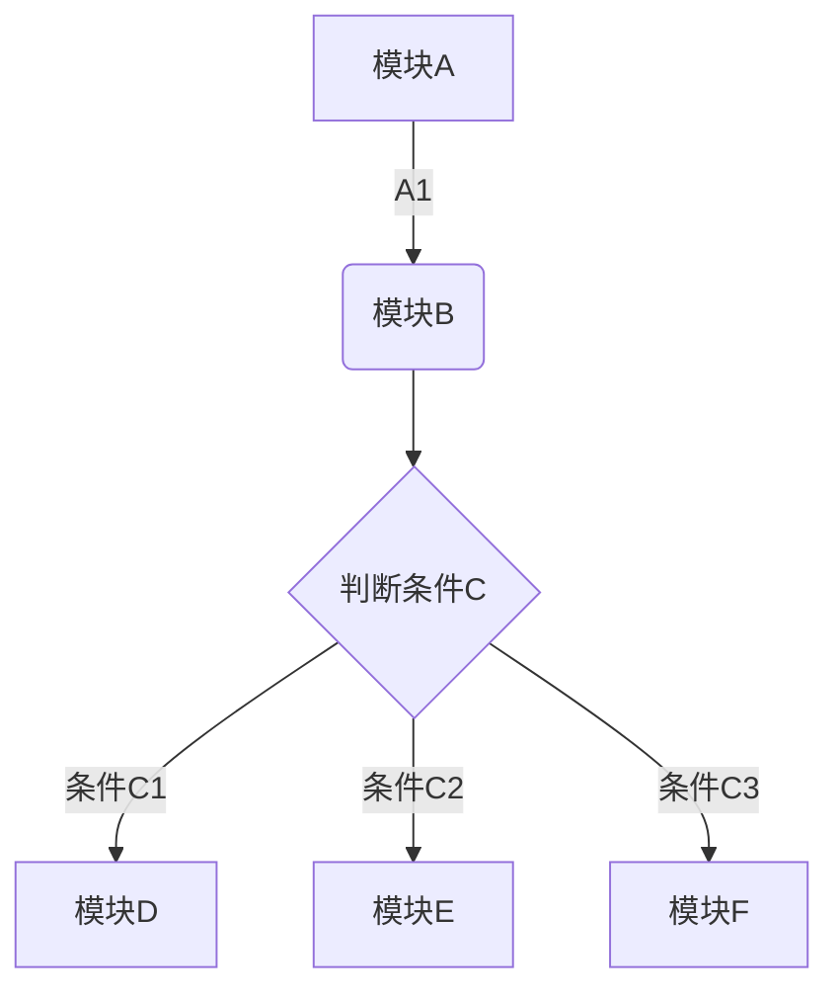

[TOC]
# 第一章 标题练习
# 这是一级 标题
## 这是二级标题
### 这是三级标题
#### 这是四级标题
###### 这是五级标题
# 第二章 字体练习
## 2.1 加粗文本练习
加粗前：印象笔记
加粗后：**印象笔记**
## 2.2 斜体练习
我后面的字是斜体：*我是斜体*
## 2.3 下划线练习
后面加入下划线:<u>大家好，我下面有下划线 </u>
## 2.4 删除线练习
后面的文字又有删除线：~~大家好，我身上有删除线，我被删除了~~
## 2.5 添加分隔线
我下面有个分隔线
***
上面是分隔线
----
我也是分割线
# 第三章 引用文本练习
>我是引用文本
>>我是引用的文本
>>>我也是
>>>>>>>>>嘿嘿

# 第四章 添加符号列表或者数字列表
使用 iOS 版本印象笔记如何快速保存内容？
1. 启用印象笔记 Widget ——印象笔记·剪贴板
2. 复制粘贴任意内容
     * 微信
3. 滑动到 Widget 插件区域即可完成保存
印象笔记·剪贴板有什么特点？
* 快：开启自动模式，可以自动保存剪贴板的任意内容
* 一切：只要可以复制粘贴就可以保存
* 有序：全部保存在「我的剪贴板」笔记本并以时间来命名
## 4.1 无序列表
无序列表使用- + * 任何一种都可以
* 我是使用*的无序列表例子
- 我是使用-的无序列表例子
+ 我是使用+的无序列表例子
- 注意所有的- + * 与后文都要有空格
## 4.2 有序列表
语法：直接数字加点
1. 列表内容
2. 列表内容
3. 列表内容
4. 注意序号和内容之间要有空格
## 4.3 列表嵌套
- 列表上一级与下一级之间敲三个空格即可
* 一级无序列表
   - 二级无序列表
   - 二级
      + 三级
      + 三级无序列表
* 一级无序列表
   1. 二级有序
   2. 二级有序
      1. 三级有序
      2. 三级有序
# 第五章 表格

表头|表头|表头|
---|:--:|---:
内容|内容|内容
内容|内容|
第二行分割表头和内容。
-有一个就行，为了对齐，多加了几个
文字默认居左
-两边加：表示文字居中
-右边加：表示文字居右
注：原生的语法两边都要用 | 包起来。此处省略

姓名|技能|排行|
---|:--:|--:
我是左对齐|我是居中|我是右对齐
刘备|哭|大哥
关羽|打|二哥
张飞|骂|三弟
# 第六章 代码

语法：
单行代码：代码之间分别用一个反引号包起来

`create datebase hero;`

代码块：代码之间分别用三个反引号包起来，且两边的反引号单独占一行
```
    function fun(){
             echo "这是一句非常牛逼的代码";
        }
        fun();
```
```python
#!/usr/bin/python
import re

line = "Cats are smarter than dogs"

matchObj = re.match( r'(.*) are (.*?) .*', line, re.M|re.I)

if matchObj:
    print "matchObj.group() : ", matchObj.group()
    print "matchObj.group(1) : ", matchObj.group(1)
    print "matchObj.group(2) : ", matchObj.group(2)
else:
    print "No match!!"
```

# 第七章 流程图

# 第八章 代办事项

三只青蛙
* [x]第一只青蛙
* [ ]第二只小青蛙
* [ ]第三只小青蛙
# 第九章 插入链接
[印象笔记官网](https://www.yinxiang.com/)

# 第十章 插入图片


